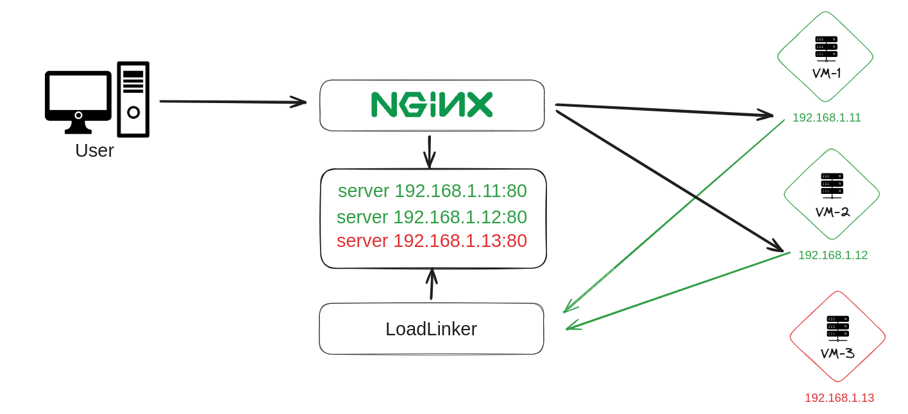

# LoadLinker
LoadLinker serves as a network discovery tool designed to assist Nginx in efficiently directing traffic to the appropriate server.
It swiftly identifies a healthy server within a second and seamlessly incorporates it into the load balancer configuration.
By employing LoadLinker, you enhance the availability of your service and mitigate the risk of downtime.

### Operation Overview
To get started with LoadLinker you need to understand the agent/server communication, with distinct roles assigned to each component. The server assumes the vital task of monitoring cluster health, while the agent facilitates communication with LoadLinker server.
The agents on target machines initiate a request to the server to obtain its IP address. The server, conducting health checks every second, dynamically decides whether to register the target host in the configuration or not.


In this example, LoadLinkerAgent is installed on 3 VM and pinging the LoadLinker server.
We can see that the VM-3 is down, LoadLinker server will remove it from the configuration and the traffic will be redirected to VM-1 and VM-2.

### Installation
#### LoadLinker Server
```bash
Installation script comming soon...
```
#### LoadLinker Agent
```bash
Installation script comming soon...
```

### Build Instructions
```bash
mkdir build && cd build
cmake -G "Unix Makefiles" .. && cmake --build .
```

### Testing Procedure
To run the test, execute the following command in your terminal:
```bash
cd test && ./run_test.sh
```
Now you can type `localhost` in your browser and refresh the page to see requests load balancing.
You can also down a server to see how LoadLinker reacts to it : `docker stop machine1`

If you want to go further, you can also display upstream file like this:
```bash
docker exec -it loadbalancer /bin/watch -n1 "cat /etc/loadlinker/upstream.conf"
```
To stop the test and remove the containers, run the command on the test directory:
```bash
docker-compose -f docker-compose.yml down
```